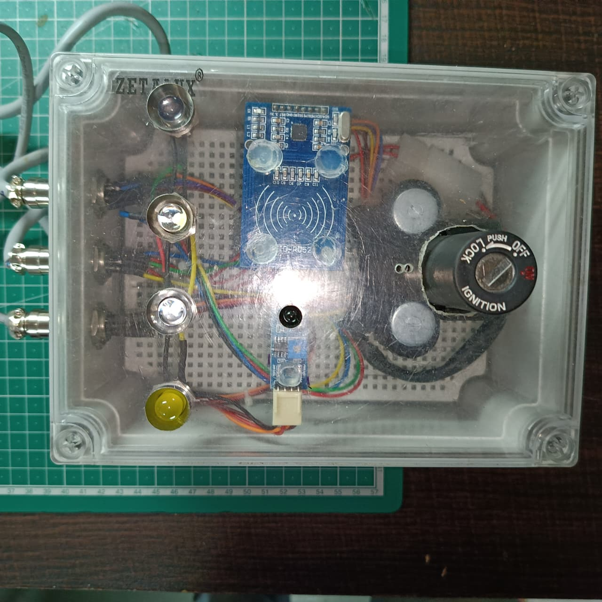
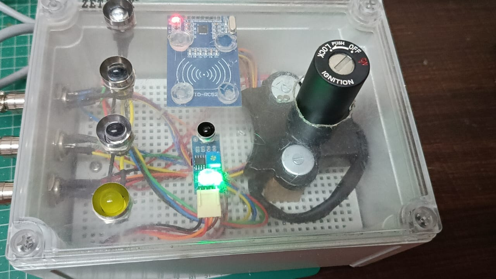
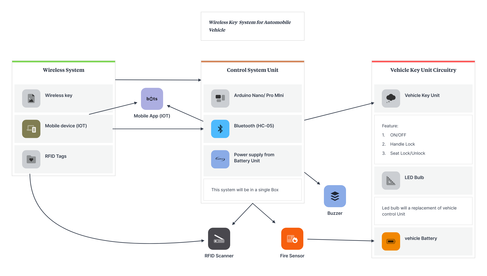

# Wireless-Key-System-Automobile

Overview

This project implements a smart wireless key system that allows secure access and control of an automobile using RFID authentication, Bluetooth mobile application, and wireless communication.

---

Objectives

* Replace conventional vehicle keys
* Provide multi-mode secure access
* Enable remote vehicle control
* Improve vehicle safety and convenience

---

Working Principle

* User authenticates using RFID tag or mobile app
* Bluetooth connects smartphone to system
* Arduino Nano processes commands
* Relay module controls vehicle functions
* Flame sensor triggers alarm in hazardous conditions

---

HardwareSetup

### Power OFF

### Power ON

---

Features

* Engine ON/OFF control
* Handle lock control
* Seat lock/unlock
* Lights and horn control
* RFID-based authentication
* Bluetooth mobile control
* Fire detection with buzzer

---

Components Used

* Arduino Nano
* RFID Reader + Tags
* Bluetooth Module HC-05
* 4-Channel Relay Module
* Flame Sensor
* Buzzer
* Vehicle Battery Interface

---

Block Diagram

---

Applications

* Smart bikes and scooters
* Vehicle anti-theft systems
* Remote ignition systems
* IoT vehicle security

---

Future Scope

* GPS tracking integration
* GSM alerts
* Mobile app enhancements
* Biometric authentication

---

